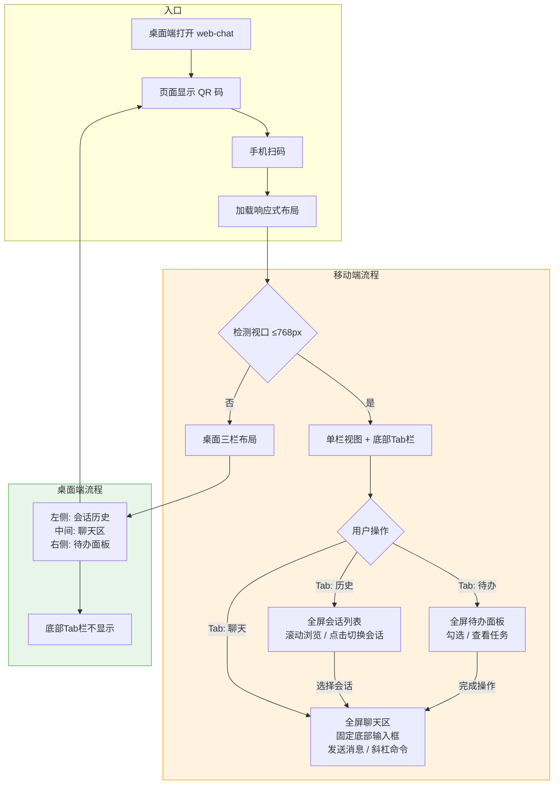

# Design Specification

> Generated: 2026-06-01
> Source: /devflow:blueprint
> Based on: devflow/requirements.md (R-014 ~ R-018)

## Business Process Flow

用户发送命令消息 → 解析XML标签 → 渲染命令卡片；AI回复含mermaid代码块 → 调用mermaid.js渲染SVG图表。

```mermaid
flowchart TD
    subgraph 用户操作
        A[用户在输入框执行斜杠命令] --> B{消息包含 command 标签?}
    end

    subgraph 命令卡片渲染流程 R-014~R-016
        B -->|是| C[正则解析 command-name + command-args]
        C --> D{解析成功?}
        D -->|是| E[按命令组匹配颜色/图标]
        E --> F[渲染为 command-card 卡片DOM]
        D -->|失败| G[降级显示原始文本]
        B -->|否| H[走原有普通用户消息路径]
    end

    subgraph AI回复渲染流程 R-017~R-018
        I[AI 回复到达] --> J[parseSegments 解析分段]
        J --> K{检测到 mermaid 代码块?}
        K -->|是| L[调用 mermaid.render 异步渲染SVG]
        L --> M{渲染成功?}
        M -->|是| N[插入 SVG 图表到消息中]
        M -->|失败| O[降级显示代码块 + 错误提示]
        K -->|否| P[走原有 renderCodeBlock 路径]
    end

    style 命令卡片渲染流程 fill:#e8f5e9,stroke:#4caf50
    style AI回复渲染流程 fill:#e3f2fd,stroke:#2196f3
```

## Scope & Boundaries

### In Scope
- 用户消息中 `<command-message>` XML 标签的解析与卡片式渲染
- 命令卡片的分组着色样式（devflow / superpowers / 默认）
- mermaid.js CDN 引入与初始化配置
- ` ```mermaid ` 代码块的 SVG 渲染替换代码块展示
- mermaid 渲染失败的降级处理

### Out of Scope (Non-Goals)
- 后端修改（所有适配在前端完成）
- 引入其他 markdown 库（marked / markdown-it 等）
- Mermaid 图表的点击放大、导出、编辑功能
- 命令的交互能力（可点击跳转等）
- 暗色模式切换（当前 UI 仅浅色主题）

## Technical Standards

- **编码规范：** 与现有 chat.js 风格一致 — 函数式、无框架、原生 DOM 操作
- **架构约束：** 不引入构建工具，不改变现有 parseSegments 管道结构；mermaid 作为唯一外部依赖通过 CDN 引入
- **技术选型：** mermaid.js v11.x（CDN: cdn.jsdelivr.net/npm/mermaid/dist/mermaid.min.js）
- **性能要求：** mermaid 初始化不阻塞页面首屏；每个 mermaid 块异步独立渲染，单个失败不影响其他块

## Design Decisions

| Decision | Rationale | Alternatives Considered |
|----------|-----------|------------------------|
| 正则解析 XML 标签而非 DOMParser | 消息内容是字符串而非 HTML 片段，正则更轻量 | DOMParser 需要先将字符串包装为 HTML，过度工程 |
| 在 addMessage 中拦截 user 类型 | 单一入口，不影响 assistant/system/error 等其他类型 | 在 renderAssistantHtml 中处理 — 但命令标签只出现在 user 消息中 |
| mermaid.render 异步 + 占位符替换 | mermaid.render 返回 Promise，需要先占位后替换 | 同步阻塞等待 — 会冻结 UI |
| securityLevel: 'antiscript' | 防止 mermaid 注入恶意脚本 | 'loose' 安全性不足；'strict' 可能限制合法语法 |
| 命令分组用前缀匹配（devflow: / superpowers:） | SLASH_COMMANDS 数据源已有 cmd 字段带前缀 | 维护单独的分组映射表 — 多余的数据结构 |
| CSS 变量复用现有主题色 | 保持视觉一致性，减少新增颜色值 | 全新配色 — 与现有 decision-card / tag-row 风格割裂 |

## Risks & Mitigations

| Risk | Impact | Mitigation |
|------|--------|------------|
| mermaid CDN 加载失败或超时 | 所有 mermaid 图表无法渲染 | try/catch 包裹 mermaid.render()，降级为代码块显示 |
| `<command-message>` 格式变化（后端升级） | 正则解析失效，显示原始标签 | 解析失败时降级为 textContent 显示原始文本 |
| mermaid 语法错误导致渲染异常 | 该图表区域空白 | catch 后显示原始代码 + 小字错误提示 |
| 大型 flowchart 渲染耗时 | 消息区短暂闪烁/空白 | 保留 code-block 外壳作为 loading 骨架屏 |

---
---

## 移动端响应式适配 + QR码扫码 (R-019 ~ R-029)

### Business Process Flow

用户从桌面端打开 web-chat → 页面显示 QR 码 → 手机扫码直接进入聊天（无需手动输 URL）。移动端自动切换为单栏 + 底部 Tab 布局。桌面端体验不变。



### Scope & Boundaries

#### In Scope
- CSS `@media (max-width: 768px)` 断点，三栏 → 单栏垂直堆叠
- 移动端底部固定 Tab 栏（聊天 / 历史 / 待办），切换面板
- 移动端侧边栏（历史会话）全宽展示，滚动列表，选会话自动切回聊天
- 移动端工具面板（待办）全宽展示
- 移动端输入栏固定底部，safe-area-inset，触摸友好发送按钮
- Server 绑定 0.0.0.0，启动时输出局域网 IP URL
- 桌面端页面展示 QR 码（含局域网 URL），手机扫码即访问
- 触摸交互：斜杠命令下拉可手指选择、代码块展开折叠触摸友好、滚动区 momentum 滚动
- 桌面端 ≥769px 布局和功能与改造前完全一致

#### Out of Scope (Non-Goals)
- PWA Manifest / Service Worker 离线缓存
- 暗色模式切换
- 微信小程序 / 原生 APP
- 远程公网穿透
- 后端 Service Worker 或消息推送
- 引入任何新框架或 npm 依赖（QR 码用纯前端轻量实现）

### Technical Standards

- **编码规范：** 与现有 chat.js 一致 — 函数式、原生 DOM 操作、零框架
- **架构约束：** 不引入构建工具，不改变现有 HTML 结构语义，仅增加 CSS 和少量 JS
- **CSS 断点：** 768px 为移动端阈值，≥769px 保持现有桌面布局
- **QR 码生成：** 纯前端实现（Canvas API），不引入外部 CDN 依赖，或使用内联轻量库
- **性能要求：** QR 码生成不阻塞页面首屏；媒体查询切换无闪烁

### Design Decisions

| Decision | Rationale | Alternatives Considered |
|----------|-----------|------------------------|
| 单断点 768px（非 Mobile-First 重写） | 最小改动，桌面端零风险，现有三栏布局作为默认保留 | Mobile-First 重写 — 改动量过大，风险高 |
| 底部 Tab 栏用 CSS media query 控制显隐 | 结构简单，无需 JS 检测设备 | JS matchMedia 动态切换 — 增加复杂度 |
| QR 码放在桌面端页面内 | 用户已在桌面端打开页面，一眼看到，扫码即连 | 终端输出 QR 码 ASCII — 辨识度差，手机无法扫终端 |
| QR 码用纯 Canvas API 生成 | 零依赖，代码量小（~50行），满足需求 | qrcode.js CDN — 引入外部依赖，违背项目理念 |
| 侧边栏/工具面板移动端全宽展示 | 复用现有 DOM，仅切换可见性 + 宽度，无需重建 | 新建独立移动端面板 — 双份维护 |
| Server 绑定 0.0.0.0 | 所有网络接口可用，局域网设备可访问 | 仅绑定特定 IP — 切换网络后失效 |
| safe-area-inset-bottom 用于 iOS 刘海屏适配 | 标准 CSS 环境变量，无需 JS 检测 | JS 检测设备型号 — 不可靠且过度工程 |

### Risks & Mitigations

| Risk | Impact | Mitigation |
|------|--------|------------|
| 服务器绑定 0.0.0.0 暴露给局域网所有设备 | 安全性 | Token 认证加固：Server 启动时生成 randomUUID，所有 HTTP/WebSocket 请求必须携带有效 token，不匹配返回 403 |
| QR 码中的局域网 IP 变化（切换 WiFi） | QR 码指向失效 | 刷新页面重新生成 QR 码即可 |
| 移动端 CSS 改动影响桌面端 | 桌面布局异常 | 所有移动样式严格限制在 @media 内，桌面端 selector 不加修改 |
| iOS Safari 软键盘弹出遮挡输入框 | 无法输入消息 | visualViewport API 检测键盘高度，动态调整输入栏位置 |
| 某些 Android 浏览器不支持 safe-area-inset | 底部内容被导航栏遮挡 | 使用 fallback padding，确保基本可用 |

---

*Tracked by DevFlow. Do not edit manually.*
