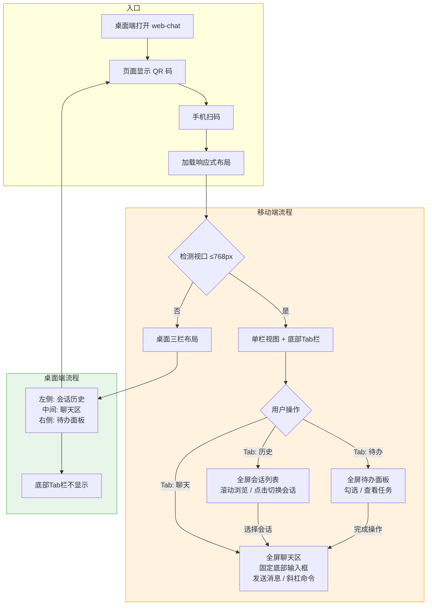
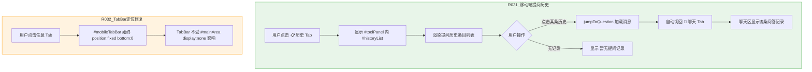
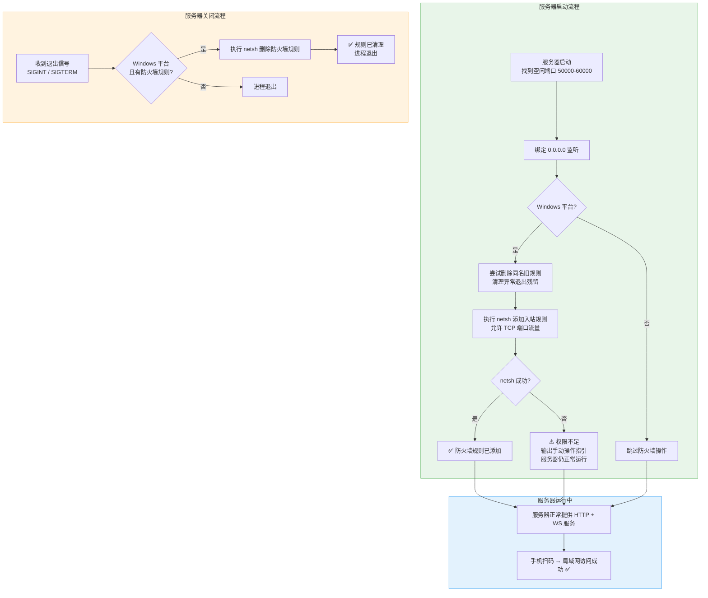

# Design Specification

> Generated: 2026-06-01
> Source: /devflow:blueprint
> Based on: devflow/requirements.md (R-014 ~ R-018)

## Business Process Flow

用户发送命令消息 → 解析XML标签 → 渲染命令卡片；AI回复含mermaid代码块 → 调用mermaid.js渲染SVG图表。

```mermaid
flowchart TD
    subgraph 用户操作
        A[用户在输入框执行斜杠命令] --> B{消息包含 command 标签?}
    end

    subgraph 命令卡片渲染流程 R-014~R-016
        B -->|是| C[正则解析 command-name + command-args]
        C --> D{解析成功?}
        D -->|是| E[按命令组匹配颜色/图标]
        E --> F[渲染为 command-card 卡片DOM]
        D -->|失败| G[降级显示原始文本]
        B -->|否| H[走原有普通用户消息路径]
    end

    subgraph AI回复渲染流程 R-017~R-018
        I[AI 回复到达] --> J[parseSegments 解析分段]
        J --> K{检测到 mermaid 代码块?}
        K -->|是| L[调用 mermaid.render 异步渲染SVG]
        L --> M{渲染成功?}
        M -->|是| N[插入 SVG 图表到消息中]
        M -->|失败| O[降级显示代码块 + 错误提示]
        K -->|否| P[走原有 renderCodeBlock 路径]
    end

    style 命令卡片渲染流程 fill:#e8f5e9,stroke:#4caf50
    style AI回复渲染流程 fill:#e3f2fd,stroke:#2196f3
```

## Scope & Boundaries

### In Scope
- 用户消息中 `<command-message>` XML 标签的解析与卡片式渲染
- 命令卡片的分组着色样式（devflow / superpowers / 默认）
- mermaid.js CDN 引入与初始化配置
- ` ```mermaid ` 代码块的 SVG 渲染替换代码块展示
- mermaid 渲染失败的降级处理

### Out of Scope (Non-Goals)
- 后端修改（所有适配在前端完成）
- 引入其他 markdown 库（marked / markdown-it 等）
- Mermaid 图表的点击放大、导出、编辑功能
- 命令的交互能力（可点击跳转等）
- 暗色模式切换（当前 UI 仅浅色主题）

## Technical Standards

- **编码规范：** 与现有 chat.js 风格一致 — 函数式、无框架、原生 DOM 操作
- **架构约束：** 不引入构建工具，不改变现有 parseSegments 管道结构；mermaid 作为唯一外部依赖通过 CDN 引入
- **技术选型：** mermaid.js v11.x（CDN: cdn.jsdelivr.net/npm/mermaid/dist/mermaid.min.js）
- **性能要求：** mermaid 初始化不阻塞页面首屏；每个 mermaid 块异步独立渲染，单个失败不影响其他块

## Design Decisions

| Decision | Rationale | Alternatives Considered |
|----------|-----------|------------------------|
| 正则解析 XML 标签而非 DOMParser | 消息内容是字符串而非 HTML 片段，正则更轻量 | DOMParser 需要先将字符串包装为 HTML，过度工程 |
| 在 addMessage 中拦截 user 类型 | 单一入口，不影响 assistant/system/error 等其他类型 | 在 renderAssistantHtml 中处理 — 但命令标签只出现在 user 消息中 |
| mermaid.render 异步 + 占位符替换 | mermaid.render 返回 Promise，需要先占位后替换 | 同步阻塞等待 — 会冻结 UI |
| securityLevel: 'antiscript' | 防止 mermaid 注入恶意脚本 | 'loose' 安全性不足；'strict' 可能限制合法语法 |
| 命令分组用前缀匹配（devflow: / superpowers:） | SLASH_COMMANDS 数据源已有 cmd 字段带前缀 | 维护单独的分组映射表 — 多余的数据结构 |
| CSS 变量复用现有主题色 | 保持视觉一致性，减少新增颜色值 | 全新配色 — 与现有 decision-card / tag-row 风格割裂 |

## Risks & Mitigations

| Risk | Impact | Mitigation |
|------|--------|------------|
| mermaid CDN 加载失败或超时 | 所有 mermaid 图表无法渲染 | try/catch 包裹 mermaid.render()，降级为代码块显示 |
| `<command-message>` 格式变化（后端升级） | 正则解析失效，显示原始标签 | 解析失败时降级为 textContent 显示原始文本 |
| mermaid 语法错误导致渲染异常 | 该图表区域空白 | catch 后显示原始代码 + 小字错误提示 |
| 大型 flowchart 渲染耗时 | 消息区短暂闪烁/空白 | 保留 code-block 外壳作为 loading 骨架屏 |

---
---

## 移动端响应式适配 + QR码扫码 (R-019 ~ R-029)

### Business Process Flow

用户从桌面端打开 web-chat → 页面显示 QR 码 → 手机扫码直接进入聊天（无需手动输 URL）。移动端自动切换为单栏 + 底部 Tab 布局。桌面端体验不变。



### Scope & Boundaries

#### In Scope
- CSS `@media (max-width: 768px)` 断点，三栏 → 单栏垂直堆叠
- 移动端底部固定 Tab 栏（聊天 / 历史 / 待办），切换面板
- 移动端侧边栏（历史会话）全宽展示，滚动列表，选会话自动切回聊天
- 移动端工具面板（待办）全宽展示
- 移动端输入栏固定底部，safe-area-inset，触摸友好发送按钮
- Server 绑定 0.0.0.0，启动时输出局域网 IP URL
- 桌面端页面展示 QR 码（含局域网 URL），手机扫码即访问
- 触摸交互：斜杠命令下拉可手指选择、代码块展开折叠触摸友好、滚动区 momentum 滚动
- 桌面端 ≥769px 布局和功能与改造前完全一致

#### Out of Scope (Non-Goals)
- PWA Manifest / Service Worker 离线缓存
- 暗色模式切换
- 微信小程序 / 原生 APP
- 远程公网穿透
- 后端 Service Worker 或消息推送
- 引入任何新框架或 npm 依赖（QR 码用纯前端轻量实现）

### Technical Standards

- **编码规范：** 与现有 chat.js 一致 — 函数式、原生 DOM 操作、零框架
- **架构约束：** 不引入构建工具，不改变现有 HTML 结构语义，仅增加 CSS 和少量 JS
- **CSS 断点：** 768px 为移动端阈值，≥769px 保持现有桌面布局
- **QR 码生成：** 纯前端实现（Canvas API），不引入外部 CDN 依赖，或使用内联轻量库
- **性能要求：** QR 码生成不阻塞页面首屏；媒体查询切换无闪烁

### Design Decisions

| Decision | Rationale | Alternatives Considered |
|----------|-----------|------------------------|
| 单断点 768px（非 Mobile-First 重写） | 最小改动，桌面端零风险，现有三栏布局作为默认保留 | Mobile-First 重写 — 改动量过大，风险高 |
| 底部 Tab 栏用 CSS media query 控制显隐 | 结构简单，无需 JS 检测设备 | JS matchMedia 动态切换 — 增加复杂度 |
| QR 码放在桌面端页面内 | 用户已在桌面端打开页面，一眼看到，扫码即连 | 终端输出 QR 码 ASCII — 辨识度差，手机无法扫终端 |
| QR 码用纯 Canvas API 生成 | 零依赖，代码量小（~50行），满足需求 | qrcode.js CDN — 引入外部依赖，违背项目理念 |
| 侧边栏/工具面板移动端全宽展示 | 复用现有 DOM，仅切换可见性 + 宽度，无需重建 | 新建独立移动端面板 — 双份维护 |
| Server 绑定 0.0.0.0 | 所有网络接口可用，局域网设备可访问 | 仅绑定特定 IP — 切换网络后失效 |
| safe-area-inset-bottom 用于 iOS 刘海屏适配 | 标准 CSS 环境变量，无需 JS 检测 | JS 检测设备型号 — 不可靠且过度工程 |

### Risks & Mitigations

| Risk | Impact | Mitigation |
|------|--------|------------|
| 服务器绑定 0.0.0.0 暴露给局域网所有设备 | 安全性 | Token 认证加固：Server 启动时生成 randomUUID，所有 HTTP/WebSocket 请求必须携带有效 token，不匹配返回 403 |
| QR 码中的局域网 IP 变化（切换 WiFi） | QR 码指向失效 | 刷新页面重新生成 QR 码即可 |
| 移动端 CSS 改动影响桌面端 | 桌面布局异常 | 所有移动样式严格限制在 @media 内，桌面端 selector 不加修改 |
| iOS Safari 软键盘弹出遮挡输入框 | 无法输入消息 | visualViewport API 检测键盘高度，动态调整输入栏位置 |
| 某些 Android 浏览器不支持 safe-area-inset | 底部内容被导航栏遮挡 | 使用 fallback padding，确保基本可用 |

---

## 移动端提问历史 + TabBar 定位修复 (R-031 ~ R-032)

### Business Process Flow

移动端"📋 历史"Tab 从会话列表改为提问历史列表，点击条目自动切回聊天并加载消息。底部 TabBar 修复为 fixed 定位，切换时不再跳到顶部。



### Scope & Boundaries

#### In Scope
- 移动端"📋 历史"Tab 显示 `#historyList` 提问历史（替换原 `#sidebar` 会话列表）
- 点击历史条目 → `jumpToQuestion()` + 自动切回聊天 Tab
- `#mobileTabBar` 添加 `position: fixed; bottom: 0; left: 0; right: 0` 确保始终固定底部
- 移动端待办 Tab 行为不变（仍显示 `#toolPanel`）
- PC 端（≥769px）零退化

#### Out of Scope (Non-Goals)
- 不改 PC 端右侧面板布局或行为
- 不新增数据结构（复用现有 `state.questions` + `#historyList`）
- 不改历史条目的样式（复用现有 `.history-item` 样式）
- 会话列表在移动端的入口（后续可考虑移到其他位置，本次不处理）

### Technical Standards

- **编码规范：** 与现有 chat.js 风格一致 — 函数式、原生 DOM 操作
- **架构约束：** 仅修改 CSS 和 JS 中的 tab 切换逻辑，不改 HTML 结构
- **CSS 策略：** 所有改动严格限制在 `@media (max-width: 768px)` 内

### Design Decisions

| Decision | Rationale | Alternatives Considered |
|----------|-----------|------------------------|
| "历史"Tab 复用 `#historyList` 而非新建 DOM | 零重复代码，PC/移动共用同一数据源和渲染逻辑 | 新建独立移动端历史面板 — 双份维护 |
| `jumpToQuestion()` 后自动切回聊天 Tab | 用户期望看到消息内容，停留在历史列表无意义 | 停留在历史 Tab — 用户需手动切回，体验差 |
| `#mobileTabBar` 用 `position: fixed` | 彻底脱离文档流，不受兄弟元素 display 变化影响 | 用 flex + order — 无法解决 display:none 导致的塌缩 |
| 待办 Tab 仍显示完整 `#toolPanel` | 待办面板内容少，全屏展示无问题；仅历史需要单独处理 | 待办也单独抽离 — 过度拆分 |

### Risks & Mitigations

| Risk | Impact | Mitigation |
|------|--------|------------|
| `#toolPanel` 在历史 Tab 下同时暴露了待办区域 | 用户困惑，看到不该看的内容 | CSS 隐藏 `.panel-section:not(.panel-section-history)` 或用新 class 控制显隐 |
| `position: fixed` 在 iOS Safari 的 viewport 问题 | 键盘弹出时 fixed 元素可能异常 | 已有 visualViewport 监听器处理键盘适配；tab bar z-index 设为 20 确保在最上层 |

---
---

## Windows 防火墙自动管理 (R-044 ~ R-048)

### Business Process Flow

服务器启动 → 绑定端口 → 自动添加 Windows 防火墙入站规则（允许 TCP 流量到该端口）→ 手机扫码即可从局域网访问。服务器退出时自动清理规则。权限不足时输出手动指引，不阻塞启动。



### Scope & Boundaries

#### In Scope
- 服务器 `listen()` 成功后，通过 `netsh advfirewall firewall` 添加 TCP 入站规则
- 服务器退出时（SIGINT/SIGTERM）自动删除对应防火墙规则
- 启动前先清理同名残留规则（处理异常退出场景）
- 权限不足时输出中文错误提示 + 手动 netsh 命令示例
- 仅 Windows 平台生效（`process.platform === 'win32'`）
- 防火墙规则管理函数导出为可测试接口

#### Out of Scope (Non-Goals)
- 不关闭或禁用 Windows 防火墙
- 不开放所有端口，仅允许当前监听端口
- 不支持 Linux/macOS 的 iptables/pf 防火墙（这些平台默认不阻止本地端口）
- 不做 Windows 防火墙 profile 区分（Domain/Private/Public），统一处理
- 不修改已有的 graceful shutdown 逻辑（仅在现有信号处理中追加清理）
- 不做自动提权（不弹 UAC 对话框）

### Technical Standards

- **编码规范：** 与现有 server.mjs 风格一致 — ESM、函数式、Node.js 原生 API
- **架构约束：** 新增两个导出函数 `addFirewallRule(port)` / `removeFirewallRule(port)`，放在 `server.mjs` 中现有 `getLanAddress` 函数附近
- **命令执行：** 使用 `child_process.execSync` 执行 netsh（同步调用，确保添加完成后才输出 LAN URL；删除用 try/catch 静默处理）
- **规则命名：** `"Claude Chat Server (port:xxxxx)"` — 包含端口号便于识别，删除时按名称精确匹配
- **错误处理：** netsh 失败时 console.warn，不 throw，不阻塞启动流程

### Design Decisions

| Decision | Rationale | Alternatives Considered |
|----------|-----------|------------------------|
| `execSync` 而非 `exec`（异步） | 防火墙规则必须在服务器对外可用前添加完成；同步调用确保时序正确 | 异步 `exec` — 可能在 listen callback 输出 LAN URL 之后才完成，用户扫码时规则还没生效 |
| 规则名称含端口号 | 每次启动端口可能不同，按名称精确删除不会误删其他实例的规则 | 使用固定名称 — 无法区分多个实例，且重启时端口变化会导致旧规则残留 |
| 先 delete 再 add | 处理上次异常退出残留的规则，`netsh delete` 对不存在的规则会返回非零退出码，静默忽略即可 | 先查询是否存在再决定 — 多一次 netsh 调用，逻辑更复杂 |
| 删除用 `execSync` + `try/catch` | 退出清理应尽量可靠，同步确保在进程真正退出前执行完毕 | `atexit` 回调 — Node.js 没有标准的 atexit，且异步操作在 exit 事件中不可靠 |
| 仅 Windows 平台执行 | macOS/Linux 默认防火墙不阻止本地监听端口，不需要额外配置 | 全平台统一 — 但 Linux/macOS 无 netsh 命令会报错 |
| 不自动弹 UAC 提权 | 自动提权会弹出系统对话框打断用户体验，且 Claude Code 以终端运行不适合 GUI 交互 | 通过 PowerShell `Start-Process -Verb RunAs` 提权 — 会启动新终端窗口，用户体验差 |

### Risks & Mitigations

| Risk | Impact | Mitigation |
|------|--------|------------|
| 非管理员权限运行导致 netsh 失败 | 手机扫码仍无法连接 | console.warn 输出完整的手动 netsh 命令示例 + "请以管理员身份运行" 提示；服务器仍正常启动（桌面端不受影响） |
| Windows 防火墙规则名长度限制或特殊字符 | netsh 命令执行失败 | 规则名称仅使用字母、空格、括号、冒号、数字，无特殊字符；长度 < 50 字符 |
| 进程被 SIGKILL（强杀）无法执行清理 | 防火墙规则残留 | 下次启动时先 delete 再 add（R-046）；残留规则仅允许特定端口，安全风险低 |
| `execSync` 在 listen callback 内阻塞事件循环 | 高并发场景下短暂延迟 | netsh 执行通常 < 50ms，且 listen callback 仅执行一次，不影响运行时性能 |
| 多个 claude-chat 实例同时运行 | 端口冲突或规则覆盖 | 每个实例使用独立端口 + 独立规则名（含端口号），互不干扰 |

---
---

## 移动端体验优化：Tab Bar 遮挡修复 + QR 码参数完善 + Header 项目名显示 (R-049 ~ R-051)

### Business Process Flow

桌面端打开 web-chat → QR 码包含项目路径和会话 ID → 手机扫码自动进入对应项目和会话 → 手机端 Header 显示项目名和会话名 → 输入框不被 Tab Bar 遮挡 → 手机端历史消息完整同步。

```mermaid
flowchart TD
    subgraph 桌面端生成二维码
        A[用户打开桌面端 web-claude-chat] --> B[页面加载当前项目和会话]
        B --> C[右下角显示 QR 码]
        C --> D[QR 码内容包含:<br/>项目路径 + 会话ID + Token]
    end

    subgraph 手机端扫码连接
        E[手机扫码] --> F[打开带完整参数的 URL]
        F --> G{URL 包含项目路径?}
        G -->|是| H[自动进入指定项目]
        G -->|否| I[显示项目选择页面]
        H --> J{URL 包含会话ID?}
        J -->|是| K[自动加载指定会话的历史]
        J -->|否| L[显示空状态，等待用户操作]
        K --> M[手机端显示完整历史对话]
    end

    subgraph 手机端布局适配
        N[手机页面加载] --> O[检测视口宽度]
        O -->|≤768px| P[应用移动端布局]
        P --> Q[输入区域底部预留 56px]
        Q --> R[Tab Bar 固定底部，不遮挡输入框]
        R --> S[Header 显示项目名 + 会话名]
    end

    style 桌面端生成二维码 fill:#e8f5e9,stroke:#4caf50
    style 手机端扫码连接 fill:#e3f2fd,stroke:#2196f3
    style 手机端布局适配 fill:#fff3e0,stroke:#ff9800
```



### Scope & Boundaries

#### In Scope
- **R-049: 移动端输入区域底部预留 Tab Bar 空间**
  - 修复 `#inputArea` 的底部布局，使其视觉区域不被固定定位的 Tab Bar（56px）遮挡
  - 修改 `#mainArea` 的底部边距，确保滚动到最底部时最后一条消息不被 Tab Bar 遮挡
  - CSS 修改严格限制在 `@media (max-width: 768px)` 内
  - 桌面端（≥769px）布局不受影响
  - 历史/待办 Tab 的布局不受影响

- **R-050: QR 码 URL 包含当前项目路径和会话 ID**
  - 修改 `renderQRCode()` 函数，生成包含项目路径和会话 ID 的完整 URL
  - URL 格式从 `http://IP:port/?token=xxx` 改为 `http://IP:port/project/<encoded-project>/?session=<sessionId>&token=<token>`
  - 前端使用已有数据（`state.project` + `state.sessionId` + `window.location.search`）构造 URL
  - 无 session 时（新会话状态），URL 不含 session 参数，手机端进入默认空状态

- **R-051: 移动端 Header 显示项目名和会话名**
  - 移动端 Header 区域显示当前项目的短名称（路径最后一段）+ 会话名（或 session ID 前 8 位）
  - 格式如 `web-claude-chat-plugin · 2657ac1e...`
  - 文字在 375px 屏幕宽度下不换行溢出（text-overflow: ellipsis）
  - 桌面端 Header 不受影响

#### Out of Scope (Non-Goals)
- 不改变桌面端布局和 QR 码位置
- 不新增后端 API（QR 码 URL 在前端构造）
- 不修改会话数据的存储方式
- 不做项目切换器（后续 R-036 单独处理）
- 不修改 Tab Bar 的固定定位逻辑（保持 position: fixed）
- 不调整桌面端 Header 的显示内容

### Technical Standards

- **编码规范：** 与现有 chat.js 和 chat.css 风格一致 — 函数式、原生 DOM 操作、零框架
- **CSS 策略：** 所有移动端样式修改严格限制在 `@media (max-width: 768px)` 内，桌面端选择器不加修改
- **JavaScript 策略：** 使用现有 `state` 对象中的 `project` 和 `sessionId` 数据，不引入新的状态管理
- **URL 构造：** 使用 `encodeURIComponent()` 对项目路径进行 URL 编码，确保特殊字符安全
- **响应式断点：** 继续使用 768px 作为移动端阈值，≥769px 保持现有桌面布局
- **性能要求：** 所有修改为纯 CSS 和轻量 JS 逻辑，不引入额外渲染开销

### Design Decisions

| Decision | Rationale | Alternatives Considered |
|----------|-----------|------------------------|
| `#inputArea` 使用 `margin-bottom: 56px` 而非 `padding-bottom` | `margin-bottom` 在文档流中为固定 Tab Bar 预留空间，不影响输入框自身的视觉样式 | `padding-bottom` — 会在输入框内部创建空白，视觉上不自然 |
| `#mainArea` 添加 `padding-bottom: 56px` | 确保滚动到最底部时，最后一条消息不被固定 Tab Bar 遮挡 | 修改消息列表容器 — 更复杂，需要调整多个嵌套元素 |
| QR 码 URL 使用 `window.location.origin` 作为基础 | 自动适配当前协议和端口，无需手动拼接 | 从 LAN URL API 获取 — 需要额外的异步调用 |
| QR 码 URL 包含 `state.project` 和 `state.sessionId` | 利用已有的前端状态数据，确保 URL 与当前页面一致 | 从 URL 解析 — 但移动端可能没有这些参数 |
| 移动端 Header 使用 `text-overflow: ellipsis` | 在小屏幕（375px）上防止文字溢出，保持布局整洁 | 多行显示 — 会增加 Header 高度，破坏整体布局 |
| 项目名使用路径最后一段（`split('/').pop()`） | 简洁明了，用户一眼就能识别项目 | 显示完整路径 — 太长，在小屏幕上无法阅读 |
| 会话名优先使用 `state.sessionNames` 中的自定义名 | 用户可能为会话设置了有意义的名称，比 ID 更易识别 | 只显示 session ID — 用户无法识别会话内容 |

### Risks & Mitigations

| Risk | Impact | Mitigation |
|------|--------|------------|
| `margin-bottom` 在不同浏览器中表现不一致 | 输入框位置异常 | 测试 Chrome、Safari、Firefox 移动端；使用 `env(safe-area-inset-bottom)` 兼容 iOS |
| `state.sessionId` 为 null 时 QR 码 URL 缺少会话参数 | 手机端进入空状态 | 添加条件判断，仅在 `state.sessionId` 存在时拼接 session 参数 |
| 项目路径包含特殊字符（如中文、空格） | URL 编码问题 | 使用 `encodeURIComponent()` 进行标准 URL 编码 |
| 移动端 Header 文字过长（项目名 + 会话名） | 文字被截断，用户看不到完整信息 | 使用 `text-overflow: ellipsis` + `title` 属性显示完整文本（长按/悬停可见） |
| 桌面端用户缩放浏览器窗口到 <769px | 意外触发移动端布局 | 这是预期行为（响应式设计），确保桌面端布局在 ≥769px 时不受影响 |
| QR 码 URL 过长导致二维码密度过高 | 扫码识别率下降 | 项目路径和 session ID 通常为 20-40 字符，二维码容量足够（QR Code 可存储 4000+ 字符） |

---

*Tracked by DevFlow. Do not edit manually.*
